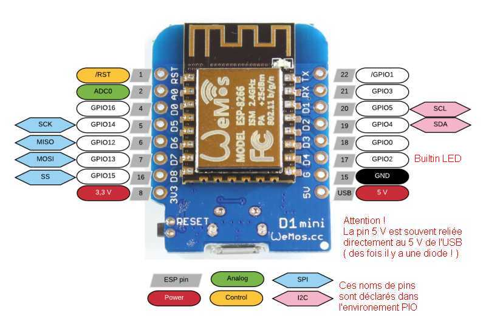
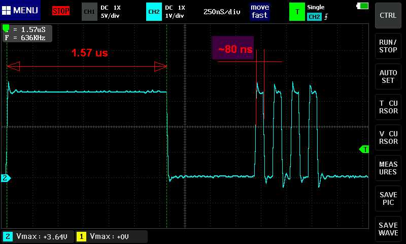

# ESP8266 — Fast Digital Write

Parti sur un projet de GPS data logger avec avec un module Arduino Pro Mini, j’ai été bloqué par le manque de mémoire de ce petit print. Je l’ai donc remplacé par un WEMOS D1 (d1_mini_lite).

Le premier tourne à 8 MHz avec 32 kB de *flash* et 2 kB de RAM, alors que le second tourne à 80 MHz avec 1 MB de *flash* et 80 kB de RAM.

Certes l’Arduino a plus de ports mais le WEMOS en a suffisamment pour l’application et sa dimension réduite me convient aussi.

Reste qu’il faut prendre garde aux spécificités du WEMOS qui, basé sur un ESP8266, oblige à respecter les états de certains ports au *boot* si  on a envie qu’il démarre !

Vous trouverez les infos ici :<br/>
<https://randomnerdtutorials.com/esp8266-pinout-reference-gpios/>.<br/>
Il y a aussi une copie de cette page au format PDF dans le répertoire `doc` de ce projet.

<p align="center">

</p>

Et bien que les valeurs de mémoire soient impressionnantes, le noyau RTOS de l’ESP prend pas mal de place et de temps !!!

Le WIFI est certes inutile dans mon cas, mais ça ne gêne même pas la consommation.

Par contre le fait que l’ESP tourne à 80 MHz m’a intrigué et j’ai voulu voir comment se comportait une sortie lors d’un `digitalWrite(port, state);`

Alors vous trouverez un petit soft (projet PlatformIO avec un `main.cpp` et le `platformio.ini` qui lui est nécessaire), avec quelques commentaires et dont le résultat se résume avec l’image ci-dessous :

<p align="center">

</p>

La première impulsion de ~1.5 µs laisse penseur avec une clock à 80 MHz !!!

Elle est bien générée avec :

```C++
digitalWrite(LED_BUILTIN, HIGH);
digitalWrite(LED_BUILTIN, LOW);
```

Alors la documentation d’Espressif donne quelques informations et le lien ci-dessous aussi :<br/>
<https://github.com/esp8266/esp8266-wiki/wiki/gpio-registers>

Et les 4 impulsions suivantes sont générées avec ces recommandations... et là, ma foi, le timing est un peu différent !

Ça peut peut-être vous servir.

...avec le retour d’une mauvaise météo, je reviendrai avec la présentation du GPS data logger...

Salutations à tous.

Alain
